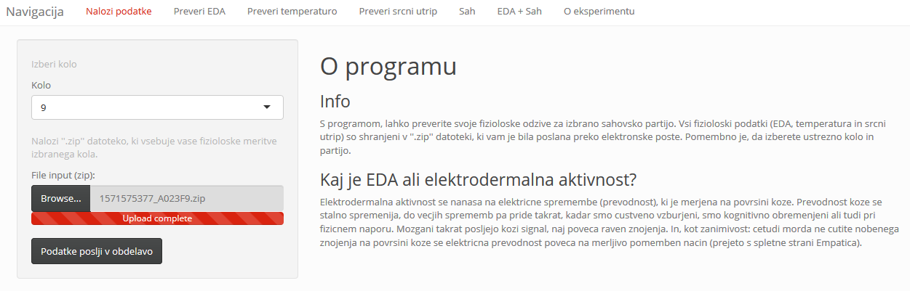
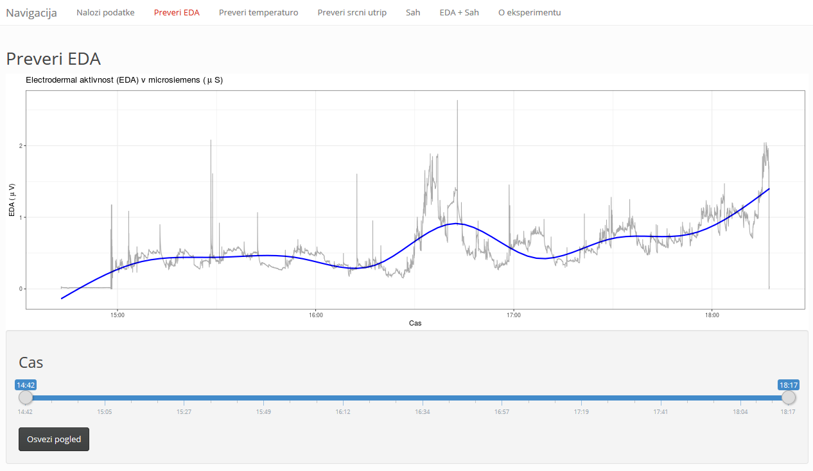
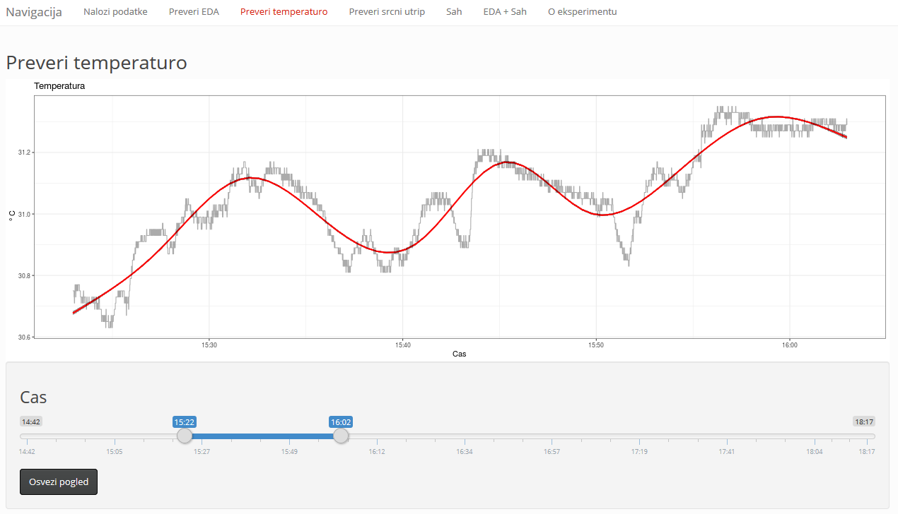
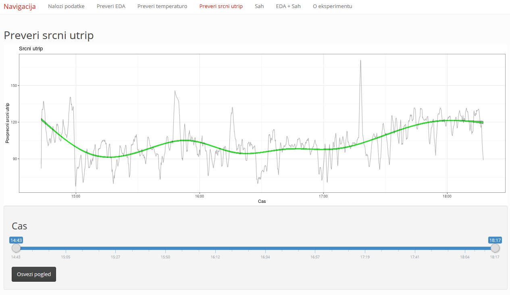
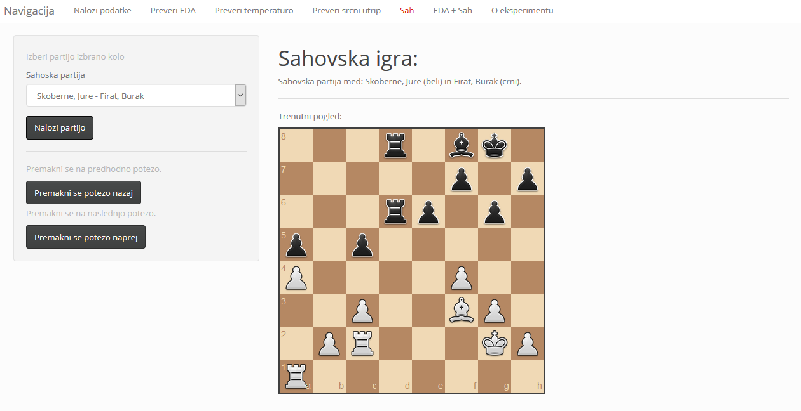
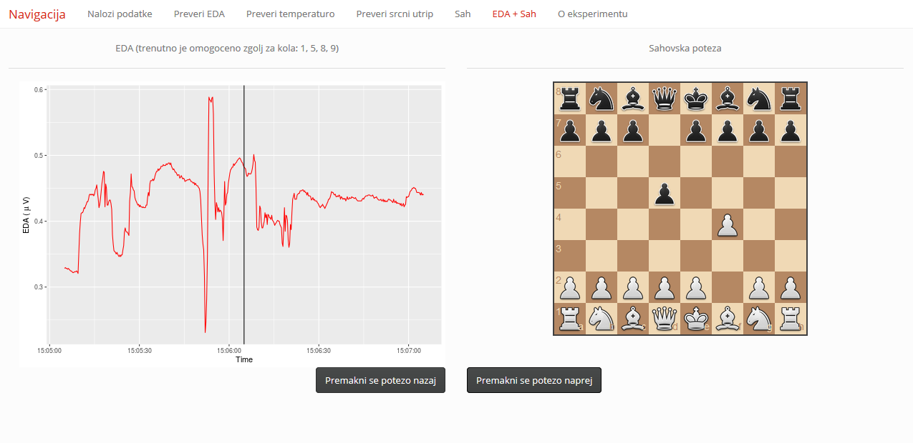

# Navodila za uporabo aplikacije - Shinny Chess

Pripravil: Matej Mencin

## Nalaganje podatkov in izbira kola šahovskega turnija

Podatke naložite v program Shinny Chess v zavihku *"Nalozi podatke"* s klikom na gumb *"Browse".* V nadaljevanju je potrebno izbrati datoteko z vašimi fiziološkimi podatki.

V kolikor bi vas zanimalo tudi vzporedno spremljanje vašega EDA odziva s posamezno šahovsko potezo je potrebno izbrati ustrezno šahovsko kolo.

Na koncu je potrebno podatke poslati v obdelavo s klikom na gumb *"Podatke poslji v obdelavo"*.

## Opis zavihkov

- Zavihek *"Nalozi podatke"* omogoča, da podatke naložite v aplikacijo.

- Zavihki *"Preveri EDA"*; "*Preveri temperaturo*"; *"Preveri srcni utrip*" omogoča spremljanje EDA odziva, temperature in srčnega utripa med šahovsko partijo. Izberete lahko tudi časovno okno prikaza podatkov.

  

  **Preveri EDA:**

  

  

  **Preveri temperaturo:**

  

  

  **Preveri srčni utrip:**

  

  

- Zavihek *"Sah"* omogoča, da izberete ustrezno šahovsko partijo predhodno izbranega kola. V nadaljevanju se lahko premikate po posameznih potezah. <u>Ko bodo podatki uspešno naloženi se vam mora prikazati šahovnica, na kateri je zadnja poteza šahovske partije.</u>

**Šah:**

- Zavihek *"EDA + Sah"* omogoča vzporedno spremljanje šahovske partije z EDA odzivom.

**EDA + Šah:**

## ! Opomba !

V kolikor želite spremljati EDA in šah je nujno potrebno izbrati ustrezno partijo v zavihku *"Sah"* in jo naložiti v program s klikom na gumb *"Nalozi partijo"*.

